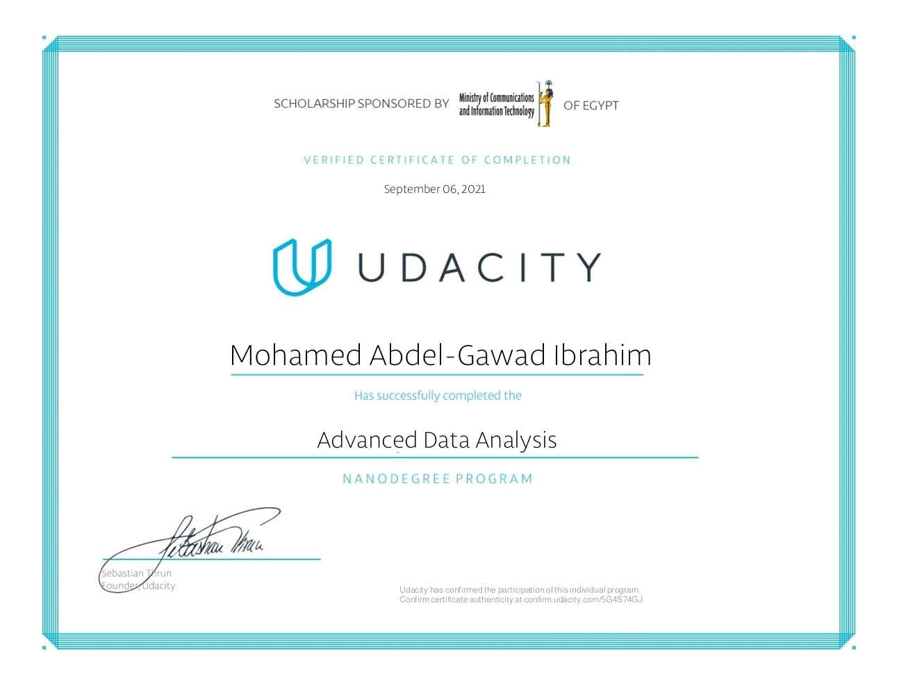

# Advanced Data Analysis Nanodegree by Udacity

## Overview

This project includes all the notebooks and exercises of my work that I practiced during my study of the Advanced Data Analysis Nanodegree by Udacity.

I also included some important text lessons to refer back to them.

## Main Topics:

* Bivariate Exploration

* Confidence Intervals

* Explanatory Visualization

* Hypothesis Testing

* Multivariate Exploration of Data

* Probability with Python

* Regression

* Sampling Distributions

* Simsons Paradox

* Univariate Exploration of Data

* Visualization Case Study

* A/B Testing Case Study

## Certification

After nearly two months of hard studying, I completed the following projects:

* [Analyze A/B Test Results project](https://github.com/m-abdelgawad/analyze-AB-test-results) 

* [Communicate Data Findings](https://github.com/m-abdelgawad/Communicate-Data-Findings)  

And received my nanodegree certificate:

## About The Author

* Author: Mohamed Abdel-Gawad Ibrahim
* Contact: muhammadabdelgawwad@gmail.com
* Phone: +201069052620 || +201147821232
